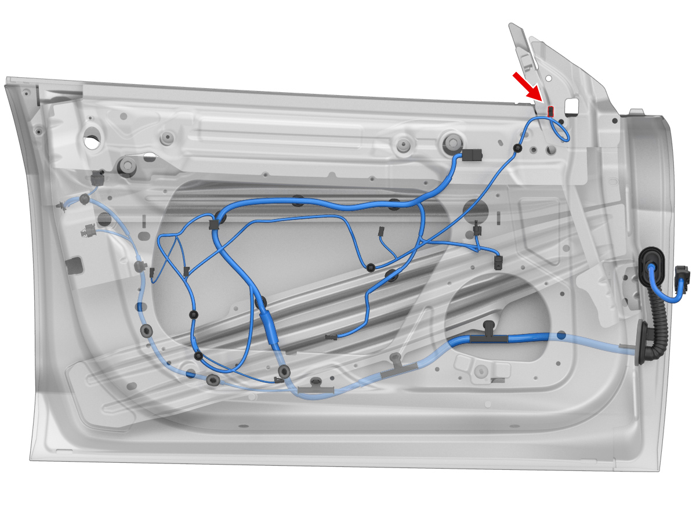
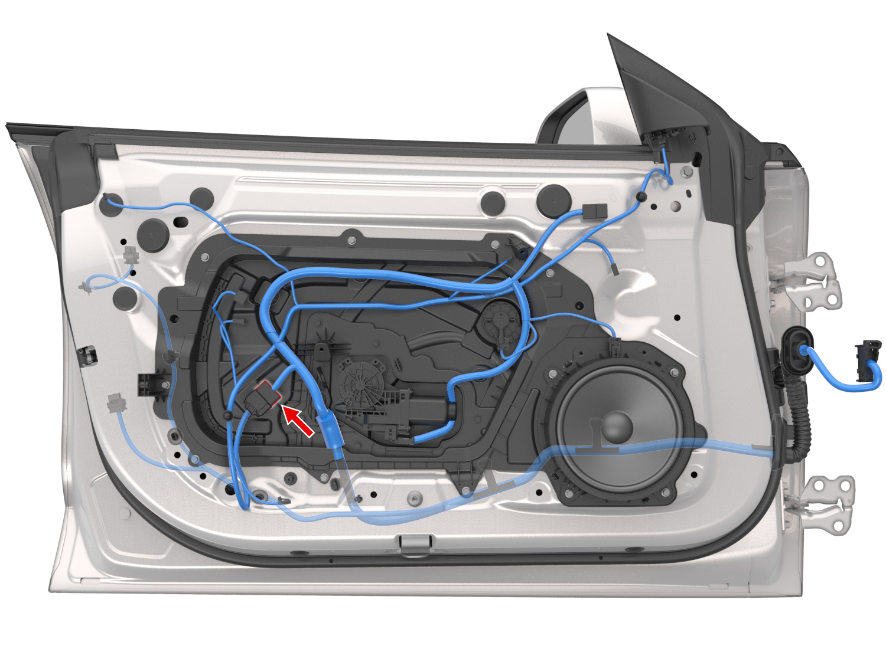
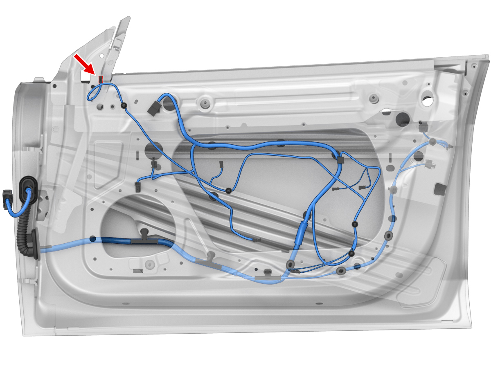
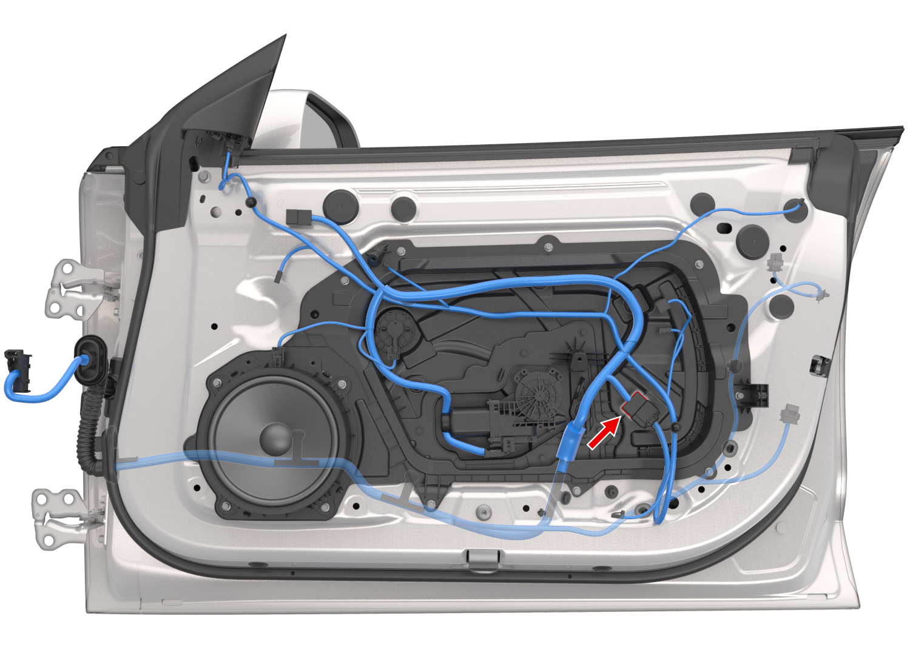
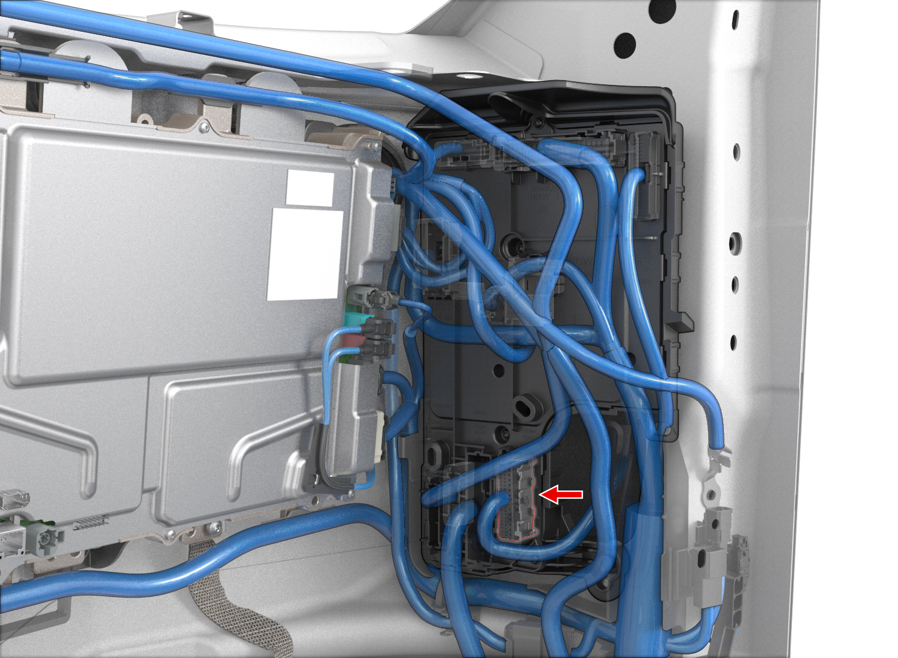

# Tesla Model 3 Highland SOP9 BASE AUDIO: Non-destructive H/I tweeter wiring

**Vehicle:** Highland SOP9, LHD, Base Audio (BAUDIO + TWTR). **Revision:** 2026-10-09.
**Installation status:** Factory electrical paths verified in option-coded SOP9 drawing; connector population and isolation on this specific car have not been measured.
**Interactive guide:** [BAUDIO 3D-model/connector routing viewer](baudio-tweeter-routing.html).
**Structured pin evidence:** [BAUDIO tweeter routing JSON](data/baudio-tweeter-interposer-2026-10-09.json).

> WARNING: This plan is BAUDIO-only. The merged connector metadata contains both BAUDIO and PAUDIO variants. The definitive source is the [original Tesla SOP9 LHD electrical SVG](../Source_Assets/core/audio_lhd.svg), which labels individual wire branches by BAUDIO/PAUDIO option code. Physical verification of populated connector cavities, polarity and amplifier isolation is mandatory before power.

## 1. Correct BAUDIO wiring, and why the old PAUDIO details were wrong

| Item | BAUDIO: **this vehicle** | PAUDIO: **DO NOT USE** |
| --- | --- | --- |
| Left front tweeter + and - at body harness | **X033B cavity 1 positive / 2 negative** | X033A cavities 5 / 6 |
| Right front tweeter + and - at body harness | **X053A cavity 5 positive / 6 negative** | X053A cavities 22 / 23 |
| Original left door woofer | **X568** | X567 |
| Original right door woofer | **X578** | X577 |
| Tweeter harness factory colours | **Violet positive / blue negative** | Use BAUDIO, not PAUDIO branch |

The original SVG marks the LH base branch **BAUDIO && LHST && TWTR** and RH branch **BAUDIO && RHST && TWTR**. The location image and metadata alone may not make this distinction because the archive includes multiple vehicle configurations. Base Audio must be selected before deriving the pin mapping.

**Left factory wiring:** Cabin body controller door branch X033B-1 (+), X033B-2 (-) to X922M/X922F 1 (+), 12 (-) to tweeter X565 1 (+), 2 (-).

**Right factory wiring:** Cabin body controller door branch X053A-5 (+), X053A-6 (-) to X923M/X923F 1 (+), 12 (-) to tweeter X575 1 (+), 2 (-).

The new Bünde Highland harness printed Front Low/TW Left/Right does NOT prove that the downstream door woofer and tweeter pairs must remain physically connected. SOP9 BAUDIO has independently identifiable tweeter conductors through the door. Measure whether the current amplifier integration coupled these circuits together before attempting to drive H and I independently.

## 2. Original Tesla vehicle models: exact factory endpoint locations

### Left / driver door

Red arrow in the Tesla original: X565, the upper-front/sail-panel tweeter connector. The rearward door wire remains part of the factory trim harness.

The red arrow identifies the door-trim inline connector X922M. Tweeter conductors are cavities 1 (violet +) and 12 (blue -).

### Right / passenger door

Red arrow: X575, upper-front/sail-panel tweeter connector.

The red arrow identifies X923M, tweeter conductors 1 (violet +) and 12 (blue -).

### Right / passenger body controller access area

This image is a genuine archived location view for X053A near the RH controller. The red arrow is the factory connector location. It does not show an aftermarket audio cable.

**Left body controller image limitation:** the archive entry labelled X033B/location.jpg is a left-door harness illustration, NOT an actual 3D controller image in the footwell. Consult Tesla's linked 2024+ LH body-controller service procedure for lower A-pillar/driver-footwell access. Do not guess a connector location from the wrong 3D picture.

**Original Tesla terminal faceviews:** [Left X033B Yazaki 7287-1674](../Source_Assets/faceviews/yazaki_7287-1674.svg) / [Right X053A Yazaki 7287-1673](../Source_Assets/faceviews/yazaki_7287-1673.svg) / [X565/X575 tweeter Delphi](../Source_Assets/faceviews/delphi_13649797.svg).

## 3. Preferred non-destructive H and I cable route

**Goal:** preserve BOTH factory flexible front-door harnesses. Add only two speaker pairs inside the cabin, one to each body-controller/door-harness junction.

1. **At the HELIX:** identify the amplifier's real installed position, since its mounting location was not conclusively verified in the repository. Plan two separate labelled flexible twisted pairs: **H+ / H- LEFT TWEETER** and **I+ / I- RIGHT TWEETER**. Do not use the Bünde Front Low/TW A/B outputs as the H/I amplifier wires.
2. **Left front footwell:** route the new H pair behind appropriately removable cabin trim towards the driver's lower A-pillar and LH body-controller/door harness region. Keep away from driver foot pedals, moving column/seat mechanisms, airbag deployment zones and other non-audio components. The original Tesla body-controller door connector must be identified before any wiring work.
3. **Right front footwell:** route the I pair to the passenger lower A-pillar/body controller in the same non-obstructing way. Use the archived X053A controller image for the general region. The added line is a **proposed installation path**, not a validated Tesla wire corridor with measured length.
4. **At each body connector:** choose a properly keyed and professionally verified **reversible mating interposer** for the ACTUAL vehicle connector housing. Every NON-audio function (door latch, window, sensor, etc.) must retain a verified original pass-through. The interposer must SEPARATE the original source signal pair from the door-side tweeter branch, then connect only the isolated downstream tweeter speaker pair to HELIX H or I. Otherwise STOP.
5. **Inside the door:** no new wire, no factory-wire cuts, no door gaiter penetration. The factory tweeter path continues via X922/923, then X565/575. Use matching reversible speaker-side connectors/adapters with the installed HELIX tweeters.
6. **After verification:** adjust DSP output A/B to woofer-only filtering and H/I to tweeter-only filtering. Low volume test individually with proper protection enabled.

A whole multiway body-controller adapter is NOT automatically safe because its connector carries unrelated vehicle functions. A custom interposer MUST be built for the actual housing, insertion depth, crimp/terminal class, lock orientation and all populated pin pass-throughs. The archive does not establish a purchase-ready, guaranteed-compatible part number. Never substitute an automotive T-tap or insulation displacement splice for this isolation.

### Tesla 2024+ official service references

- [LH body controller: lower A-pillar trim, LH footwell duct, door electrical connector](https://service.tesla.com/docs/Model3/ServiceManual/2024/en-us/GUID-66D21900-3C14-4485-96F6-727AD1424FBD.html)
- [RH body controller: glovebox, RH lower A-pillar trim, front door connector](https://service.tesla.com/docs/BodyRepair/Body_Repair_Procedures/Model_3_2024/HTML/en-us/GUID-0DFBDDB3-FC33-4808-97EB-D2891CEE2C54.html)
- [Front door tweeter replacement procedure](https://service.tesla.com/docs/Model3/ServiceManual/2024/en-us/GUID-0D39177D-4A28-4584-ABA1-9044BBB78830.html)
- [LV power disconnect / reconnect in mandatory sequence](https://service.tesla.com/docs/Model3/ServiceManual/2024/en-us/GUID-C392D1B4-3007-45A4-A469-1B92676863F1.html)

Follow the latest service sequence exactly. The LV procedure explicitly warns that incorrect disconnection sequence may damage the car computer. This guide references the BODY CONTROLLER REPLACEMENT pages only for ACCESS; it does not instruct actual module replacement or service-tool post-replacement programming.

## 4. Bench/vehicle acceptance before first power

1. Confirm BAUDIO physical connector identity: LEFT X033B cavities 1/2, RIGHT X053A cavities 5/6. Photograph shell marking and cavity numbering from the correct contact face. Explicitly exclude X033A 5/6 and X053A 22/23 PAUDIO references.
2. With Tesla LV isolated per official procedure, confirm continuity from isolated CABIN DOOR-SIDE circuit to unplugged tweeter: X033B-1/2 to X565-1/2; X053A-5/6 to X575-1/2. Disconnect OEM audio power outputs and the tweeter before applying meter resistance tests. Do not probe powered body-controller or airbag circuits.
3. Confirm electrical OPEN CIRCUIT between the chosen tweeter pair and (a) OEM original amplifier outputs, (b) physically amplified HELIX A/B door woofer return pairs, (c) chassis, (d) the other H/I channel. Never join amplifier outputs or share negative speaker conductor.
4. Verify the adapter's complete non-audio pass-through, connector sealing, contact retention, wire support and no pinches by trim/glovebox/airbag. No accidental disablement of sensor, window or door functions.
5. Store the HELIX tweeter **3500 Hz LR24 high-pass** with H/I MUTED before reconnecting the speaker. H/I remains muted until all physical continuity results have passed. A/B woofer-only 250 Hz low-pass requires proof that A/B no longer drive tweeters.
6. Commission at conservative level; test left and right separately. Verify a disabled H/I means no independent tweeter signal, no factory source backfeed, and no protective DSP overload. Re-check doors/windows/latches, basic vehicle diagnostics and full trim seating.

## 5. DSP PC-Tool crossovers for independently active BAUDIO tweeters

| Physical output | Installed loudspeaker | HPF | LPF | Startup |
| --- | --- | --- | --- | --- |
| A / B | HELIX Ci7 W200FM-S3 front door woofers, isolated from tweeters | **65 Hz LR24** | **250 Hz LR24** | -12 dB |
| C / E | HELIX Ci7 M100FM-S3 dashboard mids | **250 Hz LR24** | **3500 Hz LR24** | -12 dB |
| D | HELIX Ci3 C100.2FM-S3 MK2 centre coax | **180 Hz LR24** | OFF | -12 dB |
| **H / I** | HELIX Ci7 T20FM-SC front door tweeters on independent wiring | **3500 Hz LR24** | OFF | **-18 dB and MUTED until verified** |
| F / G | Tesla BAUDIO rear OEM | **100 Hz LR24** (default, not model-certified) | OFF | -12 dB |
| J / K | Separate Pioneer donor subs | Subsonic HPF requires enclosure details | **80 Hz LR24** | -12 dB, muted until load verified |
| L | Spare | N/A | N/A | MUTED |

VCP routes a measured reconstructed Front L Full to physical A/C/H and Front R Full to B/E/I. Do not assume that existing Tesla MCU input A+C or B+E should be summed equally without ISA measurements. The manufacturer-spec-based protective output filters above can already be saved OFFLINE, before acoustic measurements.

**Important:** H/I active tweeter signal must NOT be connected to the same wire as A/B woofer output. If actual isolation is not achieved, use the older shared/conditional mode only if there is an appropriate passive tweeter crossover and amplifier-safe combined impedance; otherwise leave the tweeter channels disconnected.

## 6. Proven vs unproven summary

- **Proven from BAUDIO option-code SVG:** X033B-1/2 LH and X053A-5/6 RH BAUDIO tweeter circuits, X922/923-1/12 door inline contacts and X565/575-1/2 tweeter contacts. Original factory front door woofer references X568/X578.
- **Not proven yet on the individual car:** populated connector cavity identities and correct contact-face view, measured isolation between OEM driver and H/I, present A/B-tweeter branch coupling, compatible off-the-shelf pass-through connector SKU, actual HELIX amplifier mounting location and additional cabin wire route clearance.
- **Not a valid inference:** PAUDIO X033A-5/6, X053A-22/23, premium woofers X567/X577, and premium amplifier wiring are NOT part of the BAUDIO wiring plan.

The [interactive left/right 3D model and routing inspector](baudio-tweeter-routing.html) is the recommended iPad/landscape installation companion.
